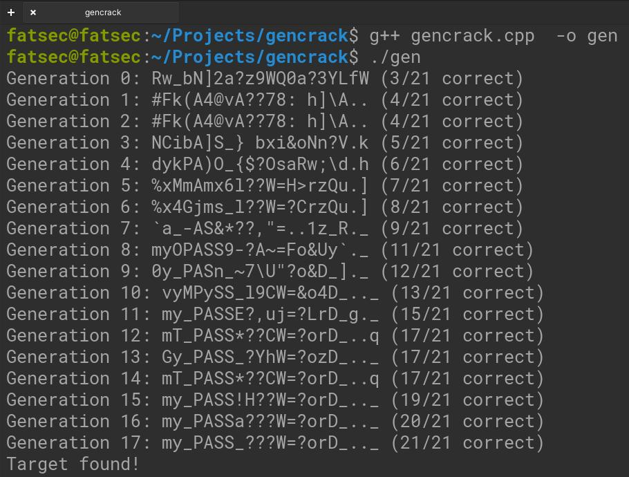

# Genetic Algorithm for String Evolution

This project demonstrates the use of a genetic algorithm to evolve a population of random strings towards a predefined target string. 

## Overview

A genetic algorithm is a search heuristic inspired by the process of natural selection. This algorithm reflects the process of natural evolution where the fittest individuals are selected for reproduction to produce the offspring of the next generation.

In this project, the genetic algorithm is applied to a simple problem: evolving a population of random strings to match a target string.

## Features

1. **Initialization:** The population is initialized with random strings.
2. **Selection:** Two parents are selected based on their fitness. The selection process involves a simple tournament selection where two random individuals are chosen, and the fittest moves forward.
3. **Crossover:** A crossover operation (or reproduction) is applied to the two parents to produce a child string.
4. **Mutation:** Each character in the child string has a chance to mutate (change to a random character) based on a predefined mutation rate.
5. **Elitism:** A certain percentage of the fittest individuals are directly moved to the next generation without going through the crossover and mutation process.

## Parameters

- `TARGET`: The target string that the population will evolve towards.
- `POP_SIZE`: The size of the population.
- `MUTATION_RATE`: The chance that an individual character will mutate.
- `GENERATIONS`: The maximum number of generations the algorithm will run for.
- `ELITE_COUNT`: The number of top individuals that will be directly transferred to the next generation without crossover and mutation.

## Example

> I added both C++ and Python examples to the repo. Let's examine the sample outputs:

- Target word for the following results: `my_PASS_???W=?orD_.._`
- Population: 1000
- Mutation Rate: 1%
- Generation: 1000
- Elite Population Rate: 10%

```bash
Generation 0: 9X_'0J<k-5mG({o#D"QYO (3/21 correct)
Generation 1: Parafzk_w?P=4v<sD_8xz (4/21 correct)
Generation 2: J'w7uSS_or?r.3-`q_b.f (6/21 correct)
Generation 3: J'w7uSS_or?r.3-`q_b.f (6/21 correct)
Generation 4: mZ?P0aN:?;?%g?XYD(Z.R (7/21 correct)
Generation 5: ehSPx2$_??O20dorD_,.} (9/21 correct)
Generation 6: ehS|g2c_??O2=?orD_8.} (10/21 correct)
Generation 7: ehS|g2c_??O2=?orD_8.} (10/21 correct)
Generation 8: e4_PASp_)??J=?orD_ZxZ (13/21 correct)
Generation 9: e4_PASp_)??J=?orD_ZxZ (13/21 correct)
Generation 10: Oy_PAS<_|??%=?orq_7.[ (14/21 correct)
Generation 11: mymPASSC???W=?!rD_T.O (16/21 correct)
Generation 12: \L|PASS_???a=?orD_.._ (17/21 correct)
Generation 13: \L|PASS_???a=?orD_.._ (17/21 correct)
Generation 14: my_PASS_?1?W=$orD_..J (18/21 correct)
Generation 15: 8y_PASS_???W=?orD_.._ (20/21 correct)
Generation 16: 8y_PASS_???W=?orD_.._ (20/21 correct)
Generation 17: my_PASS_???W=?orD_.._ (21/21 correct)
Target found!
```

As you can see, each trial and error is passed on to the next generation, and we can find such a seemingly difficult (!) word on the 17th try. Now let's change some data and try again. For the example below, the data will be as follows:

- Target word for the following results: `my_PASS_???W=?orD_.._`
- Population: 10
- Mutation Rate: 1%
- Generation: 10000
- Elite Population Rate: 5%

```bash
Generation 0: cQT}b93@"WrzR+^W{.Rq< (0/21 correct)
Generation 1: carFbu3@dW@&)+dW{.R7< (0/21 correct)
Generation 2: Rfye6u%@dWq:(-0A#NQ7n (0/21 correct)
Generation 3: jQTl6l%@dWq&~-=W#NQ7n (0/21 correct)
Generation 4: RfT}6u%#MWqz~+0WINR7n (0/21 correct)
Generation 5: #fT}6l%@MWqz~+VWINR7n (0/21 correct)
Generation 6: jQTl6l%@dWq&~-=<I.Q=n (0/21 correct)
Generation 7: #QyC6l%)dWl&,-0'2.Q7n (0/21 correct)
Generation 8: #Qye6ld)dWl&_-0,2.Q7n (0/21 correct)
Generation 9: #Qye6ls)5WlR~G#W2^a=U (0/21 correct)
Generation 10: #Qge6ls)5Wl&~G#'2^a=U (0/21 correct)
...
...
...
Generation 2959: my_PASS_???W=?orD_H._ (20/21 correct)
Generation 2960: my_PASS_???W=?orD_H._ (20/21 correct)
Generation 2961: my_PASS_???W=?orD_H._ (20/21 correct)
Generation 2962: my_PASS_???W=?orD_H._ (20/21 correct)
Generation 2963: my_PASS_???W=?orD_H._ (20/21 correct)
Generation 2964: my_PASS_???W=?orD_H._ (20/21 correct)
Generation 2965: my_PASS_???W=?orD_H._ (20/21 correct)
Generation 2966: my_PASS_???W=?orD_H._ (20/21 correct)
Generation 2967: my_PASS_???W=?orD_H._ (20/21 correct)
Generation 2968: my_PASS_???W=?orD_H._ (20/21 correct)
Generation 2969: my_PASS_???W=?orD_.._ (21/21 correct)
Target found!

```

As soon as we reduce the population number and elite population rate, our trial population also increases. Because we can now transfer fewer genes. We may also need to increase the number of generations.

> I made these experiments in C++, but code written in Python will produce similar results. Mutation and crossover here will ensure that you get different results each time. But eventually the result will be achieved.

## Customization

You can customize the parameters (like `TARGET`, `POP_SIZE`, etc.) to see how they affect the evolution process.

## Conclusion

This project provides a basic demonstration of genetic algorithms. While the problem of matching a string might seem trivial, the principles demonstrated here can be applied to more complex problems in optimization and search.

## Screenshots


